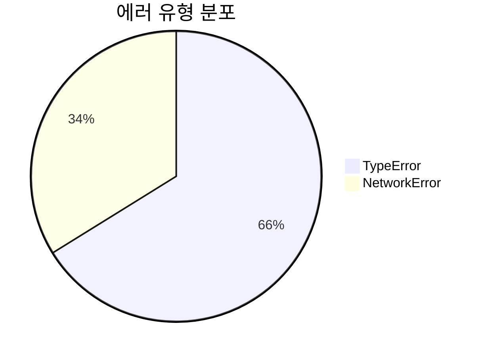

# whatap-cli - Claude Code Integration Guide

## Overview

whatap-cli는 WhatAp 모니터링 플랫폼 CLI 도구입니다. Claude Code에서 이 CLI를 사용하여 프로젝트 데이터를 조회하고, 대화 내에서 직접 시각화된 분석 결과를 제공할 수 있습니다.

## Build & Test

```bash
cargo build --release           # 릴리즈 빌드 → target/release/whatap
cargo run -- <command>          # 개발 실행
cargo test                      # 테스트
```

## Markdown Output (--markdown)

`--markdown` 플래그를 사용하면 Claude Code 대화창에서 바로 렌더링되는 Markdown 테이블로 출력됩니다:

```bash
whatap projects --markdown
whatap spot --pcode 12345 --markdown
whatap alert list --pcode 12345 --markdown
whatap step errors --pcode 12345 --markdown
```

## Chat Visualization Workflow

Claude Code 대화에서 whatapCli 데이터를 시각화하는 방법:

### Step 1: 데이터 조회 (--json 사용)

```bash
whatap spot --pcode 12345 --json           # 실시간 메트릭
whatap stat query --category app_counter --field tps --duration 1h --json  # 시계열
whatap step errors --pcode 12345 --json    # 브라우저 에러
whatap log search --level ERROR --duration 1h --json  # 에러 로그
whatap alert list --pcode 12345 --json     # 알럿 목록
```

### Step 2: 대화 내 시각화 형식

JSON 결과를 파싱한 후 다음 형식으로 대화에 렌더링:

**Markdown 테이블** - 구조화된 데이터:
```
| 시간 | TPS | 응답시간 | CPU | 에러율 |
|------|-----|---------|-----|-------|
| 09:00 | 245 | 120ms | 45% | 0.1% |
```

**ASCII 바 차트** - 시계열 트렌드:
```
에러 추이 (최근 6시간)
09:00 ████░░░░░░░░░░░░  12건
10:00 █████████████████  45건  ← 피크
11:00 █░░░░░░░░░░░░░░░   3건
```

**Mermaid 다이어그램** - 분포/비율:


### Step 3: 분석 시나리오별 명령어 조합

#### 전체 시스템 헬스체크
```bash
whatap spot --pcode <PCODE> --json
whatap alert list --pcode <PCODE> --json
```

#### 에러 분석
```bash
whatap step errors --pcode <PCODE> --duration 1h --json
whatap log search --level ERROR --duration 1h --json
whatap step ajax --pcode <PCODE> --errors --duration 1h --json
```

#### 성능 분석
```bash
whatap stat query --category app_counter --field resp_time --duration 6h --json
whatap stat query --category app_counter --field tps --duration 6h --json
whatap step pageload --pcode <PCODE> --slow 3000 --json
```

#### 브라우저 연관 분석
```bash
# 1. 페이지별 키 확인
whatap step pageload --pcode <PCODE> --duration 1h
# 2. 특정 페이지 전체 분석
whatap trace <key> --pcode <PCODE> --json
```

## Key Commands Reference

| 명령어 | 용도 | 주요 옵션 |
|--------|------|----------|
| `spot` | 실시간 메트릭 | `--keys cpu,tps,actx` |
| `stat query` | 시계열 메트릭 | `--category`, `--field`, `--duration` |
| `step errors` | JS 에러 | `--type`, `--browser`, `--page` |
| `step ajax` | AJAX 요청 | `--errors`, `--slow` |
| `step pageload` | 페이지 로딩 | `--slow`, `--page` |
| `step resources` | 리소스 로딩 | `--type`, `--slow` |
| `trace` | 연관 분석 | `--only`, `--summary`, `--raw` |
| `log search` | 로그 검색 | `--keyword`, `--level`, `--duration` |
| `alert list` | 알럿 목록 | - |
| `mxql` | 커스텀 MXQL | `--category`, `--input-json` |

## Global Flags

| 플래그 | 설명 |
|--------|------|
| `--json` | JSON 출력 (프로그래밍 분석용) |
| `--markdown` | Markdown 테이블 출력 (대화 시각화용) |
| `--quiet` | 불필요한 출력 제거 |
| `--verbose` | 상세 디버그 로깅 |
| `--profile` | 인증 프로필 선택 |
| `--no-color` | 색상 비활성화 |

## MXQL Categories

### Browser RUM
- `rum_page_load_each_page` - 페이지 로드 타이밍
- `rum_ajax_each_page` - AJAX 요청
- `rum_resource_each_page` - 리소스 로딩
- `rum_error_total_each_page` - JS 에러

### APM
- `app_counter` - TPS, 응답시간, 에러수
- `app_sql` - SQL 실행 통계
- `app_httpc` - HTTP 아웃바운드

### Infrastructure
- `server_cpu`, `server_memory`, `server_disk`, `server_network`

## Code Conventions

- Rust 2021 edition, clap derive 매크로
- 새 명령어: `src/cli/commands/`에 파일 추가 → `mod.rs` 등록 → `main.rs` Commands enum 추가
- 출력: `cli::output::print_output()` 사용 (table/json/csv/markdown 자동 분기)
- 에러: `anyhow::Result` + `core::error::CliError` (exit codes: 0/1/2/3/4/5/6)
